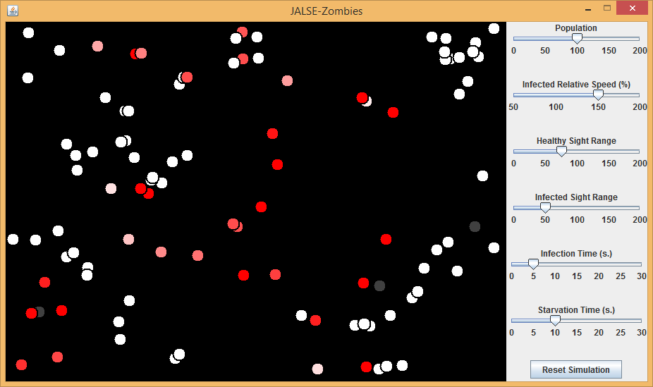

## Zombies
Zombies is a [JALSE](https://github.com/Ellzord/JALSE) example project.  Is is a small simulation in which a healthy person or people can be "infected."  Infected people chase and "bite" healthy people, until the entire population is infected (and eventually dies).

### Building and running with Gradle
1. Build using ```./gradlew build``` (see [Building Java Projects with Gradle](https://spring.io/guides/gs/gradle/#_build_your_project_with_gradle_wrapper))
2. Run using ```./gradle run``` (See [The Application Plugin](http://gradle.org/docs/current/userguide/application_plugin.html))

### Simulation details
1. Initially, 100 `Healthy` people (white circles) are spawned and wander randomly about the screen.
2. To start a simulation, click a person.  That person becomes `Infected` (red circle).
3. `Infected` people move 1.5x faster than `Healthy` ones, but `Healthy` people see 1.5x as far.  `Healthy` people always move away from the nearest visible `Infected` (or randomly if no `Infected` people are visible), and `Infected` always move toward the nearest `Healthy` person.
4. When an `Infected` person touches a `Healthy` one, the `Healthy` person is bitten and becomes a `Carrier`.  `Carrier`s move randomly and are ignored by both `Healthy` and `Infected` people as they transition from `Healthy` to `Infected`.
5. If an `Infected` person does not bite a `Healthy` person within 10 seconds, they starve to death and become a `Corpse` (gray circle).  This timer resets every time they bite a `Healthy` person.
6. Eventually, all `Infected` will die off; usually, at this point, all that remain are `Corpse`s.

### Controls
Various properties of the simulation can be adjusted using the sliders on the right.  All changes take place immediately, but you can click **Reset Simulation** if you'd like to start a new simulation with your selected settings.

* **Population**: The total number of people in the field.
* **Infected Relative Speed (%)**: The speed of `Infected`, as a percentage of the speed of `Healthy` people.
* **Healthy Sight Range**: How far `Healthy` people can see, in pixels.
* **Infected Sight Range**: How far `Infected` people can see, in pixels.
* **Infection Time (s.)**: How long it takes a person to transition from `Healthy` to `Infected`.  Nominally in seconds, but may be longer depending on performance.
* **Starvation Time (s.)**: How long it an `Infected` person can go between bites without starving.

### Screenshot


### More
See the [Wiki](https://github.com/Ellzord/JALSE/wiki) for more information.